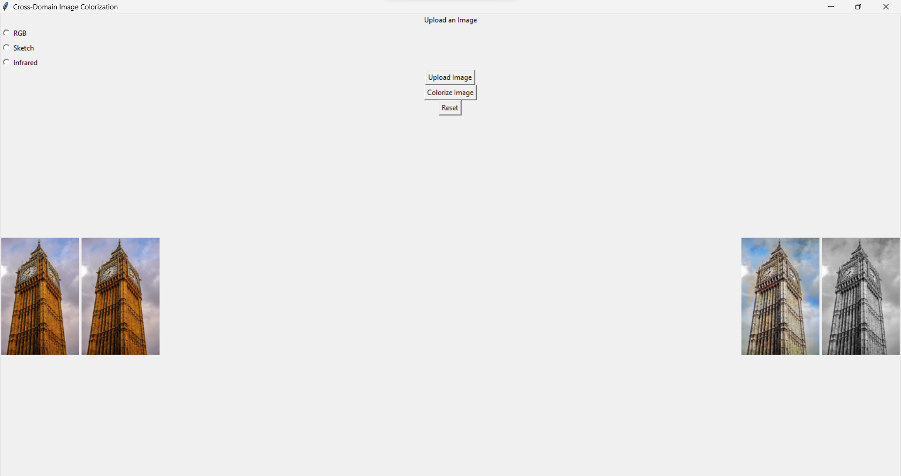

This repository contains three key tasks developed during an internship focused on deep learning-based image colorization. The project implements various models to colorize grayscale images across multiple domains, using deep learning techniques such as CNNs and data augmentation. Below are the tasks and their details:

Tasks
1. Basic Image Colorization
In this task, we implemented a simple deep learning model to colorize grayscale images. The model was trained using the CIFAR-10 dataset with TensorFlow/Keras, achieving significant colorization results.
Objective: Transform grayscale images into color using a basic convolutional neural network (CNN).
Dataset: CIFAR-10
Model: Convolutional Neural Network (CNN) with dilation
Output: Colorized images from grayscale inputs.

2. Dataset Augmentation for Improved Colorization
To enhance the colorization performance, we augmented the dataset using techniques such as rotation, flipping, and brightness adjustments. This improved the model's ability to generalize to unseen data, providing better colorization results.
Objective: Boost performance by applying data augmentation techniques to the grayscale images and comparing colorization before and after augmentation.
Techniques: Rotation, flipping, brightness alteration
Output: Comparative results of colorized images before and after augmentation.

3. Cross-Domain Image Colorization
This task explores colorization across different domains, including RGB-to-sketch and RGB-to-infrared conversions. Separate models were built for each domain, and a GUI allows users to select between RGB, sketch, and infrared domains.
Objective: Implement a flexible model adaptable to different domains with a user interface for domain selection.
Datasets: CIFAR-10 (RGB and sketch), FLIR ADAS (infrared)
Techniques:
Sketch Model: Edge detection using Canny edge detection.
Infrared Model: Infrared images were simulated by converting the red channel from RGB images as a proxy for infrared. This transformation is handled by the following function:
Output: Colorized images from different domains (RGB, sketch, infrared).

## Outputs

### Task 1: Basic Colorization Output

 

### Task 2: Before and After Augmentation

Before Augmentation          |  After Augmentation
:---------------------------:|:-------------------------:
 | 

### Task 3: Cross-Domain Colorization

**RGB to Infrared**  
Input (Infrared)             |  Colorized Output  
:---------------------------:|:-------------------------:  
 |   

**Sketch to Color**  
Input (Sketch)               |  Colorized Output  
:---------------------------:|:-------------------------:  
 | 
